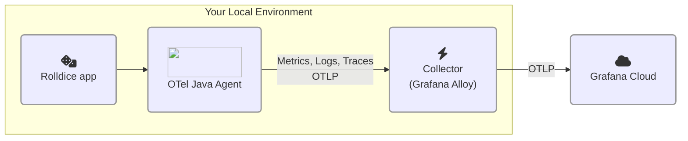

# 1.3. ゼロコード OpenTelemetry

このラボでは、ゼロコード計装をアプリケーションに追加する方法を学びます。

このステップが完了すると、以下のようなアーキテクチャになります:




## ゼロコード計装とは？

OpenTelemetry のドキュメントより:

> ゼロコード計装は、OpenTelemetry の API と SDK の機能を、**通常はエージェントまたはエージェントのようなインストールとして**アプリケーションに追加します。具体的な仕組みは言語によって異なり、バイトコード操作、モンキーパッチ、eBPF などを利用して、OpenTelemetry API と SDK への呼び出しをアプリケーションに注入します。

> 通常、**ゼロコード計装は、使用しているライブラリに対する計装を追加します。**つまり、リクエストとレスポンス、データベース呼び出し、メッセージキュー呼び出しなどが計装の対象となります。アプリケーション独自のコードは、通常は計装されません。独自コードを計装するには、コードベースの計装が必要です。

:::opentelemetry-tip[ゼロコード計装と手動計装、どちらを使うべき？]

自身のアプリケーションに OpenTelemetry を導入する場合、まずはゼロコード（自動）計装から始めることをお勧めします。ゼロコード計装は、使用しているプログラミング言語の一般的なライブラリやフレームワークを自動的に計装するように設計されています。その後、独自コードから追加のテレメトリーを取得する必要がある場合は、手動計装で補完できます。

:::


## Step 1: 計装済みアプリケーションの設定と実行

このステップでは、OpenTelemetry シグナルを Grafana Cloud の OTLP エンドポイントに直接送信するようにアプリケーションを設定します。

以下の手順に従ってください:

1.  オンライン開発環境を開きます。

1.  プロジェクトの Explorer ペインで、プロジェクトツリーを展開し、`persisted/rolldice/run.sh` を**開きます**。

    :::tip
    
    このファイルが見つからない場合は、最初のラボの「デモアプリを実行」のステップを完了していることを確認してください。重要なセットアップ手順が含まれています。

    :::

1.  サービスのユニークな名前空間（namespace）を考えます。OpenTelemetry の属性 `service.namespace` を使って、同じワークショップに参加している他の受講者のアプリケーションと区別します。

    例: `johnd` や `cthulhu` など。

    この名前を覚えておいてください。Lab 2 でも同じ名前を使用します。

1.  _rolldice_ アプリケーションの実行スクリプトを編集し、OpenTelemetry Java エージェントを追加します。

    `run.sh` ファイルで、最終行（`java -jar ...`）の**直前に**以下の行を挿入します。`<your chosen namespace>` は選んだ名前空間に置き換えてください:

    ```shell
    export NAMESPACE="<your chosen namespace>"
    export OTEL_RESOURCE_ATTRIBUTES="service.name=rolldice,deployment.environment=lab,service.namespace=${NAMESPACE},service.version=1.0-demo,service.instance.id=${HOSTNAME}:8080"
    export OTEL_EXPORTER_OTLP_PROTOCOL="grpc"
    export OTEL_EXPORTER_OTLP_ENDPOINT="http://localhost:4317"
    ```

    :::warning

    `<your chosen namespace>` を選んだ名前に必ず置き換えてください。例:

    `export NAMESPACE="fred"`

    :::

    ここでは、OpenTelemetry Java エージェントに以下の OpenTelemetry _リソース属性_ をシグナルに付加するよう設定しています:

    | リソース属性名 | 値 | 説明 |
    | ------------------ | ----- | ---- |
    | service.name | rolldice | アプリケーションの正式名称 |
    | deployment.environment | lab | アプリが実行されている環境。ここでは「lab」を使用していますが、実際には「production」「test」「development」などを使用します。 |
    | service.instance.id | (IDE のホスト名) | インスタンスを一意に識別する値。複数のインスタンスが実行されている場合に便利です。このラボ環境では一意で、IDE セッションの間持続する **ホスト名** を使用します。 |
    | service.namespace | (選んだ名前) | 同じ **環境** 内の他のアプリケーション群と区別するために使用します。複数のアプリケーションを実行している場合、グループ化しやすくなります。 |

    :::opentelemetry-tip

    OpenTelemetry のコンポーネントは、設定に **環境変数** を使うことがよくあります。`OTEL_EXPORTER_OTLP_ENDPOINT` のデフォルト値は、`localhost` のコレクターにテレメトリーを送信することを想定しています。この環境変数を省略することもできますが、何が起こっているかを明確にするため、ここでは明示的に記載しています。
    
    本番環境では、この値を `http://alloy.mycompany.com:4317` など、Alloy インスタンスの場所に設定するでしょう。

    :::

1.  引き続き `run.sh` ファイルで、**最終行を編集** して [OpenTelemetry Java エージェント](https://opentelemetry.io/docs/zero-code/java/agent/)をアタッチします:

    ```shell
    java -javaagent:opentelemetry-javaagent.jar -jar ./target/rolldice-0.0.1-SNAPSHOT.jar  
    ```

    Java に馴染みがない方へ: `-javaagent:` 引数は、プログラム起動時にエージェントをアタッチするよう Java プロセスに指示します。エージェントは、実行中のプログラムとやり取りしたり、検査したりできる別の Java プログラムです。

1.  新しいターミナルを開き（**Terminal -> New Terminal**）、以下を入力してアプリケーションを再起動します:

    ```shell
    cd persisted/rolldice

    ./run.sh
    ```

    :::tip

    小さい画面でこのワークショップを進めている場合は、ターミナルウィンドウを「ポップアウト」して別のブラウザウィンドウに表示すると、スペースを広く使えます。

    ターミナル右上の _Move View to Secondary Window_ アイコンをクリックしてください。

    :::

1.  最後に、新しいターミナルを開き（**Terminal -> New Terminal**）、k6 の負荷テストを実行してサービスにトラフィックを生成します:

    ```shell
    cd persisted/rolldice 

    k6 run loadtest.js
    ```

    負荷テストが開始され、1 時間実行されます。スクリプトを実行したままにしておきましょう。

    コンソールで負荷テストの進行状況を確認できます:

    ```
    running (0h26m56.8s), 2/2 VUs, 647 complete and 0 interrupted iterations
    default   [================>---------------------] 2 VUs  0h26m56.8s/1h0m0s
    ```

    :::info

    [k6](https://k6.io/) は Grafana が提供する負荷テストツールで、サービスへのトラフィックを簡単にシミュレートできます。_rolldice_ サービスを自動テストする k6 スクリプト（`loadtest.js`）を用意してあるので、手を休められます。

    :::

## Step 2: スモークテスト — トレースを見つける

アプリケーションにゼロコードの OpenTelemetry 計装を設定し、コレクター（Grafana Alloy）でシグナルを収集しています。

すべてが正しく動作しているか、簡単な「スモークテスト」で確認しましょう。Grafana Cloud でトレースを見つけます:

1.  Grafana Cloud インスタンスにアクセスします。

1.  メインメニューから **Explore** に移動します。

1.  `grafanacloud-xxxxx-traces`（Tempo）データソースを選択します。

1.  **Query type** で **Search** をクリックし、以下のフィルターを追加します:

    - **Service Name** ドロップダウンで **rolldice** を選択します。

    - **Tags** セクションで、**span** を **resource** に変更します。**service.namespace** タグを選択し、値に **(選んだ名前空間)** を入力します。

    **Run query** をクリックします。

1.  Grafana Cloud Traces に _rolldice_ の OpenTelemetry トレースが表示されるはずです！表示される各トレースは、k6 の負荷テストスクリプトによって生成されたリクエストを表しています。

興味があれば、トレースをさらに詳しく調べてみてください！次のセクションでは、この画面の説明と、より多くのシグナルの確認方法について解説します。

## まとめ

このラボでは、以下のことを学びました:

- OpenTelemetry Java エージェントを使って、コードを一行も書かずにアプリを計装する方法。[自身の環境で JVM アプリケーションを計装する方法については、Grafana Cloud のドキュメントを参照してください](https://grafana.com/docs/grafana-cloud/monitor-applications/application-observability/instrument/jvm/)。

- OpenTelemetry Java エージェントによる、アプリケーションからのトレース自動収集。

- OTLP（OpenTelemetry のテレメトリー送信プロトコル）でのシグナルの Grafana Cloud への送信。

- Grafana Explore を使った OpenTelemetry トレースの表示。

次のクイズに進むには「次へ」をクリックしてください。
