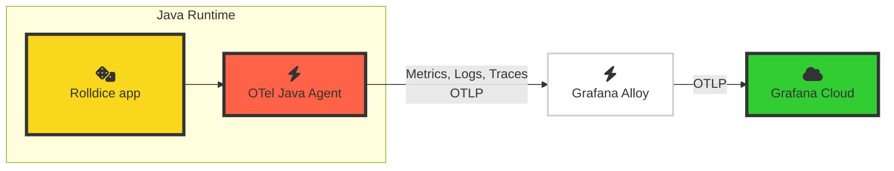

# 2.1. Grafana Cloud で OpenTelemetry を探索する

Grafana Cloud で OpenTelemetry シグナルを探索してみましょう。

前のラボモジュールで、アーキテクチャは以下のようになりました:

アプリケーションが Alloy 経由で OpenTelemetry シグナルを Grafana Cloud に送信するようになったので、Grafana インスタンスでシグナルを確認できます。

## Step 1: Application Observability を探索する

**Grafana Cloud Application Observability** は、アプリケーションの監視と MTTR（平均復旧時間）の短縮を実現するすぐに使えるソリューションです。OpenTelemetry と Prometheus の両方をネイティブにサポートし、フロントエンドやインフラ層のデータとアプリケーションテレメトリーを Grafana Cloud で統合できます。

Application Observability は、OpenTelemetry で計装されたアプリケーションの既定のビューを提供します。

1.  Grafana インスタンスにアクセスします。

1.  サイドメニューの **Application** をクリックして _Application Observability_ を開きます。

    :::tip

    キーボードを使いたい場合は、Ctrl+K（Mac では Cmd+K）で検索バーを開き、「Application」と入力して **Enter** を押します。

    :::

    Application Observability はサービスインベントリで開きます。このビューには、OpenTelemetry トレースまたはトレースベースのメトリクスを Grafana Cloud に送信しているすべてのサービスが表示されます。

1.  **Environment** ドロップダウンで、既存のエントリを（**X** ボタンで）クリアし、リストから **lab** を選択します。

    これにより、`lab` 環境で実行されていると報告している OpenTelemetry 計装済みサービスの一覧が表示されます。

1.  **+ Filter** を押してフィルターを追加します。属性名に **service.namespace** を選択し、「value」ドロップダウンから自分の名前空間を選びます。

    :::tip

    サービスインベントリに自分の名前空間が表示されない場合は、数分待ってください。スパンメトリクスの生成が始まると、アプリケーションがサービスインベントリに表示されます。

    :::

    :::opentelemetry-tip[セマンティック規約について]

    OpenTelemetry は、その規約に従うことで最大限の力を発揮します。
    
    ここでは OpenTelemetry の _セマンティック規約（semantic conventions）_ を活用しています。これは、テレメトリーシグナルに適用できる、よく知られた標準化された属性のリストです。属性を使うことで、関心のある特定のサービスインスタンスのメトリクス、ログ、トレースだけを絞り込んで表示できます。

    `service.namespace` 属性は OpenTelemetry のセマンティック規約の一部です。サービスの名前空間やグループを格納するために使用できるため、ここでのフィルターとして、他の受講者のアプリケーションと区別するのに最適です。

    また、`deployment.environment` 属性も使用しています。これは Grafana Cloud Application Observability の _Environment_ ドロップダウンリストに反映されます。

    OpenTelemetry のリソース属性は、使い慣れるほど便利さが実感できます。

    :::

1.  サービスインベントリに **rolldice** サービスだけが表示されるようになります。サービスの概要メトリクスがすぐに確認できます:

    - Duration（P95）
    - Error Rate
    - Request Rate

    Application Observability には Java のコーヒーカップロゴも表示されます。これは、OpenTelemetry の計装が `telemetry.sdk.language` 属性にランタイム情報を保存しているためです。

1.  `rolldice` サービスをクリックして Service View を開きます。

    Service View のタイトルが `<名前空間>/<サービス名>` となっており、どの名前空間を見ているかが分かります。

    Application Observability は、サービスについて通常知りたい重要な統計情報を即座に表示します:

    

    このビューでは、アプリケーションの最も重要なヘルスメトリクスを確認できます。

    - リクエストの所要時間 — 平均、95 パーセンタイル、99 パーセンタイル

    - エラーレート

    - リクエストレート

    :::info[他のソースからのメトリクスとの併用]

    Application Observability のほとんどのビジュアライゼーションでは、トレースから生成されたメトリクス（いわゆる _スパンメトリクス_）が表示されます。デフォルトでは、Application Observability がこれらのメトリクスを自動生成します。
    
    代わりに、OpenTelemetry の [Span Metrics Connector](https://github.com/open-telemetry/opentelemetry-collector-contrib/tree/main/connector/spanmetricsconnector) を使ってローカルでメトリクスを生成し、Grafana Cloud に送信することもできます。
    
    詳細は [Application Observability のドキュメント](https://grafana.com/docs/grafana-cloud/monitor-applications/application-observability/manual/configure)を参照してください。
    :::

1.  ページを下にスクロールすると、サービスで呼び出されている操作のリストと、各操作の典型的な（P95）所要時間、エラーレート、リクエストレートが表示されます:

    

## Step 2: トレース、ログ、メトリクスを探索する

トレースは OpenTelemetry の基本的な構成要素の一つです。トレースにより、システムの内部動作を観察できます。

OpenTelemetry の計装ライブラリがアプリケーションからトレースを生成し、Application Observability で確認できます。

### トレース

1.  _rolldice_ のサービス概要から、**Traces** タブをクリックします。

1.  トレースリストで **Trace ID** をクリックして、トレースビューをサイドバイサイドで開きます。

    :::tip

    トレースの詳細を見やすくするには、画面中央の縦セパレーターバーをクリックして左にドラッグし、ビューのサイズを調整できます。

    :::

1.  画面右側のトレースビューで、「Service & Operation」の見出しの下にある **rolldice** スパンをクリックし、以下を展開します:

    - Span Attributes
    
    - Resource Attributes

    OpenTelemetry エージェントが自動的にキャプチャした、豊富な属性セットを確認できます。

    

    :::opentelemetry-tip[_スパン属性_ と _リソース属性_ の違い]

    属性は、シグナルに付加されるメタデータです:

    - **スパン属性** はトレーススパンに適用され、トレースのその部分に関するメタデータを含みます。この例では、アプリの HTTP インタラクションをキャプチャする 1 つのスパンがあります。`http.route` や `url.query` のような属性で、リクエストの詳細を観察できます。

    - **リソース属性** はサービスとその実行環境に関するメタデータを含みます。`telemetry.sdk.language`（Java）、`host.name` などの属性を確認できます。

    :::

1.  属性は OpenTelemetry の強力な機能で、サービスに関する疑問に答えやすくなります。

    _スパン属性_ を見て、以下の質問に答えられますか？

    - _rolldice_ サービスは URL のクエリ文字列でプレイヤー名を受け取ります。クエリ文字列は URL の疑問符以降の部分です（例: `/myservice?param=value`）。
    
        スパン属性からプレイヤー名を見つけられますか？

        

        
回答を見る

        **スパン属性** `url.query` を確認してください。`player=John` のような値が表示されます。
        

    - サービスが実行されているノードのアーキテクチャは何ですか？
    
      

        
回答を見る

  
        **リソース属性** `host.arch` を確認してください。
        
        `amd64` と表示され、このサービスが 64 ビットの x86 ホストで実行されていることが分かります。
      

    - サービスにリクエストを送ったブラウザ（User-Agent）は何ですか？

      

        
回答を見る

  
        **スパン属性** `user_agent.original` を確認してください。
        
        `k6/0.53.0 (https://k6.io/)` のような内容が含まれているはずです。これは _k6_ がサービスにテストリクエストを生成しているためです！
      

### ログ

1.  **Logs** タブをクリックします。

1.  右側で **New Format** ボタンが選択されていることを確認します。

    

    Application Observability は Loki の LogQL クエリを作成・実行し、名前空間で絞り込んだサービスのログを表示します。
    
    また、OpenTelemetry の計装から送信された追加のコンテキスト（**スコープ名**（Java ではクラス名）、ログレベル、トレース ID など）を自動的にパースしてフォーマットします。

    

      
Grafana Cloud での OpenTelemetry ログの処理方法

      Grafana Cloud は OpenTelemetry ログに対して以下のマッピングを行います:
  
      - `service_name` を決定し、_Loki ラベル_ として使用します。
      - 他の OpenTelemetry 属性もラベルとして保存します:
          - deployment.environment（`deployment_environment` になります）
          - service.instance.id（`service_instance_id` になります）
      - 追加の OpenTelemetry 属性は _Structured Metadata_ として保存されます。これはログ行に付加されるキーバリューペアです。
  
      詳細は [Loki のドキュメント](https://grafana.com/docs/loki/latest/send-data/otel/)を参照してください。
    

1.  個々のログ行をクリックして展開します。

    Grafana Cloud は、`host.name` や `deployment.environment` などの OpenTelemetry _リソース属性_ の豊富な情報を、ピリオドをアンダースコアに置換して各ログ行に付加します。
    
    これは問題のトラブルシューティング時に非常に役立つコンテキストを提供します:

    

1.  ログからトレースへの直接相関もできます。

    少し下にスクロールし、_traceID_ の横にある **View trace** ボタンをクリックします。

    

    Traces タブに移動して特定のトレースが表示され、このリクエストの詳細情報を確認できます。

### ランタイムメトリクスと情報

トレースとログに加えて、OpenTelemetry の自動計装は、アプリケーションのランタイムメトリクスもすぐに使えるかたちでキャプチャします。

これらのメトリクスは、トレンドの監視や、トレースやログだけでは気づきにくい問題の特定に非常に役立ちます。

1.  Application Observability の _rolldice_ サービスから、**JVM** タブをクリックします。

    このタブは、計装されたサービスの言語に応じて動的に変わります。ここでは、Java アプリケーションに典型的なメトリクスが表示されます:

    - CPU 使用率

    - ヒープメモリ使用率

    など。

    

1.  最後に、画面右上のサービス名の横にある **Runtime** ドロップダウンをクリックします。

    OpenTelemetry がキャプチャしたランタイム（Java）の情報（言語など）を確認できます。

## まとめ

このラボでは、以下のことを学びました:

- Application Observability で OpenTelemetry 計装済みサービスを探索する

- リソース属性を使って特定のサービスのシグナルを絞り込み表示する

- トレースとログ間の相関と表示

- アプリケーションのランタイムメトリクスの確認

次のモジュールに進むには「次へ」をクリックしてください。
