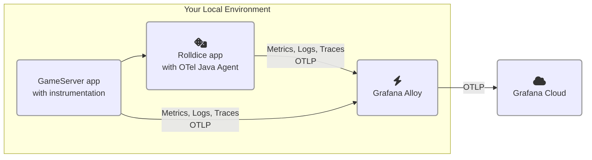

# 2.2. 2つ目のサービスを追加する

このラボでは、OpenTelemetry 計装を備えた 2 つ目のサービスをアーキテクチャに追加します。

このモジュールが完了すると、環境は以下のようになります:




## Step 1: OpenTelemetry 計装済みの Go プログラムを実行する

言語によっては、OpenTelemetry のライブラリやコードをアプリケーションに追加する必要があります。Go はこのアプローチを使う言語の一つです。

このパートでは、OpenTelemetry ライブラリで計装済みの Go プログラムを実行します。時間を節約するため、計装コードはあらかじめ追加してあります。

このサービスは _gameserver_ と呼ばれます。ユーザーとコンピューターがダイスの出目で勝負する簡単なゲームを実行します。_gameserver_ サービスは _rolldice_ サービス（Lab 1 で使用）を呼び出してサイコロを 2 回振り、出目の大きい方が勝ちです。

（注意深い方は、この仕様に何か足りないものがあることに気づくかもしれません。それが何かは、すぐに分かります！）

_gameserver_ を実行しましょう:

1.  オンライン開発環境を開きます。

1.  まず、_rolldice_ の k6 テストがまだ実行中の場合は停止します: k6 スクリプトが実行されているターミナルを見つけ、**Ctrl+C** でテストを中止し、**ターミナルを閉じます**。

1.  新しいターミナルを開き（**Terminal -> New Terminal**）、以下を入力して 2 つ目のプロジェクトを永続ワークスペースにコピーし、ディレクトリに移動します:

    ```
    cp -r /opt/gameserver /home/project/persisted/

    cd /home/project/persisted/gameserver
    ```

1.  プロジェクトの Explorer ツリーで `persisted/gameserver/otel.go` を見つけて開き、コードを確認します。

    :::tip

    自身の Go アプリケーションを計装する場合は、[Grafana Cloud ドキュメントのステップバイステップガイド][1]を参照してください。

    :::

    `otel.go` には、OpenTelemetry SDK の初期化とパッケージの自動計装を追加する _ボイラープレートコード_ が含まれています。トレース、ログ、メトリクスのエクスポーターを設定しています。

    他の OpenTelemetry 言語 SDK と同様に、環境変数で設定でき、次のステップで設定します。

1.  このアプリケーションの OpenTelemetry _リソース属性_ を設定しましょう。

    実行スクリプト `persisted/gameserver/run.sh` を開きます。最終行（`go run .`）の**直前に**、以下の行を挿入します。`<your chosen namespace>` は前のラボで選んだ名前空間と同じものに置き換えてください:

    ```shell
    export NAMESPACE="<your chosen namespace>" 
    export OTEL_RESOURCE_ATTRIBUTES="service.name=gameserver,deployment.environment=lab,service.namespace=${NAMESPACE},service.version=1.0-demo,service.instance.id=${HOSTNAME}:8090"
    ```

1.  空いているターミナルで `persisted/gameserver` ディレクトリに移動し、_gameserver_ を実行します。コードのコンパイルが必要なため、起動に 1〜2 分かかることがあります:

    ```
    cd /home/project/persisted/gameserver

    ./run.sh
    ```

    :::warning[Rolldice が実行中であることを確認]

    次のコマンドを実行する前に、_rolldice_ アプリケーションがまだ実行中であることを確認してください。_gameserver_ アプリは _rolldice_ に依存しています。_rolldice_ サービスが停止している場合は、前のラボを参照して再実行してください。

    :::


1.  最後に、サービスに負荷をかけましょう。

    :::tip

    続行する前に、Lab 1 の _rolldice_ k6 負荷テストを停止してください。k6 が実行中のターミナルを見つけて、**Ctrl+C** を押します。

    :::

    新しいターミナルで、以下のコマンドを実行します:

    ```
    cd /home/project/persisted/gameserver

    k6 run loadtest.js
    ```

    _rolldice_ にリクエストが到着するのが確認できます。k6 が _gameserver_ にテストリクエストを送り、_gameserver_ が _rolldice_ を呼び出してランダムな数値を取得しています。

このステップの完了時点で、以下のシステム全体が稼働しているはずです:

- OpenTelemetry コレクター（Grafana Alloy）

- _rolldice_ アプリケーション（Java）

- _gameserver_ アプリケーション（Go）

- _gameserver_ 負荷テストスクリプト（k6）

## Step 2: サービスマップと概要を確認する

2 つ目のサービスを計装したので、これらのサービス間のやり取りをサービスマップで視覚化できます。

1.  Grafana で Application Observability に移動します（サイドメニューから **Application** をクリック）。

1.  フィルターを使って、サービスインベントリを以下に絞り込みます:

    - environment = lab

    - service.namespace = （選んだ名前空間）

1.  **Service Map** タブをクリックします。

    指定したフィルターに一致するすべてのサービスとそのメトリクスが視覚化されます。このサービスマップはスパンメトリクスから生成されます。

    :::tip

    サービスインベントリのリストに両方のサービスが表示されない場合は、スパンメトリクスが生成されるまでしばらく待ってから、更新ボタンをクリックしてください。

    :::
    
    マップでは、_gameserver_ と _rolldice_ 間のやり取りの流れが確認できます。サービスへの 1 秒あたりのリクエスト数も表示されます:

    

1.  マップ内の **gameserver** の円をクリックし、**Service Overview** をクリックします。

    このサービスのヘルス状態を確認できます。_Downstream_ パネルでは、下流のサービス（Lab 1 の _rolldice_）が自動的に識別されています。

    

サービスにいくつかエラーが発生しているようです。次のステップで詳しく見てみましょう。


## Step 3: エラーを診断する

サービスで発生しているエラーを詳しく調べましょう。

:::opentelemetry-tip

OpenTelemetry の自動計装は、サービスがエラーを返していることを検出すると、トレースに **error** ステータスを付けることができます。これにより、サービスへの失敗したリクエストを簡単に特定できます。Grafana Cloud では、根本原因を見つけるための相関分析も簡単に行えます。

:::

1.  _gameserver_ の Service Overview 画面から、**Errors** グラフを見つけ、**Traces** ボタンをクリックしてエラーのあるトレースを表示します。

    Application Observability が _Traces_ タブに移動し、選択した時間枠で `status` が `error` のトレースが一覧表示されます。

    

    Traces タブでは、すべてのエラートレースを検索するために以下の TraceQL クエリが生成されています:

    ```
    {resource.service.name="gameserver" 
        && resource.deployment.environment=~"lab" 
        && resource.service.namespace="<NAMESPACE>" 
        && status=error}
    ```

    :::opentelemetry-tip

    この TraceQL クエリ内の OpenTelemetry 属性に気づきましたか？このクエリでは、属性名に `resource.` プレフィックスを付けて _リソース属性_ を参照しています。
    
    例: `resource.service.namespace`、`resource.service.name`
    
    :::

1.  トレースを見つけて **Trace ID** をクリックし、トレースビューを開きます。興味深いトレースが見えてきます！

    _gameserver_ アプリケーションは、ゲームの結果を計算するために _rolldice_ を 2 回呼び出してランダムな数値を取得します。

    トレースでは、_rolldice_ サービスへの 2 回の呼び出しが異なる色で表示されます:

    

1.  エラーがあったためこのトレースを表示しました。根本原因を突き止めましょう。

    エラーのあるスパン名をクリックしてトレースを展開します。サービスがエラーを返した理由が分かりますか？

    **Logs for this span** をクリックして、このスパン前後のログを確認することもできます。

    **問題: このサービスがエラーを返している理由は何だと思いますか？** このラボの最後のクイズで仮説を確認できます。

1.  エラーの原因を特定したら、トレース情報を使って以下の質問に答えてみてください:

    - これらのトレースを作成するために使用された OpenTelemetry 計装ライブラリ（名前とバージョン）は何ですか？

        <details>
        <summary>回答の見つけ方を見る</summary>

        **各スパンのヘッダーテキスト** を確認してください。_Library Name_ と _Library Version_ フィールドがあるはずです。例:

        - go.opentelemetry.io/contrib/instrumentation/net/http/otelhttp（Go の HTTP 機能用）
        - io.opentelemetry.tomcat-10.0（Java の Tomcat ウェブサーバー用）
        </details>

:::opentelemetry-tip

OpenTelemetry の _計装ライブラリ_ は、テレメトリーの基盤を構築します。アプリで使用している日常的なライブラリやフレームワークからスパンやメトリクスを生成します。

計装ライブラリは、Go のネイティブ `http` パッケージなど、多くのフレームワークやパッケージに対応しています。

:::


## まとめ

このモジュールでは、以下のことを学びました:

- 典型的な OpenTelemetry SDK のボイラープレートコードの確認

- OpenTelemetry のトレース計装を行ったサービスのサービスマップの視覚化

- エラートレースへのナビゲーションと、ログとの相関による根本原因の特定

最も重要なのは、コレクターに追加の設定が不要だったことです。Grafana Alloy はサービスからの OTLP シグナルを受信し、自動的に Grafana Cloud に転送しました。

次のモジュールに進むには「次へ」をクリックしてください。

[1]: https://grafana.com/docs/grafana-cloud/monitor-applications/application-observability/instrument/go/
